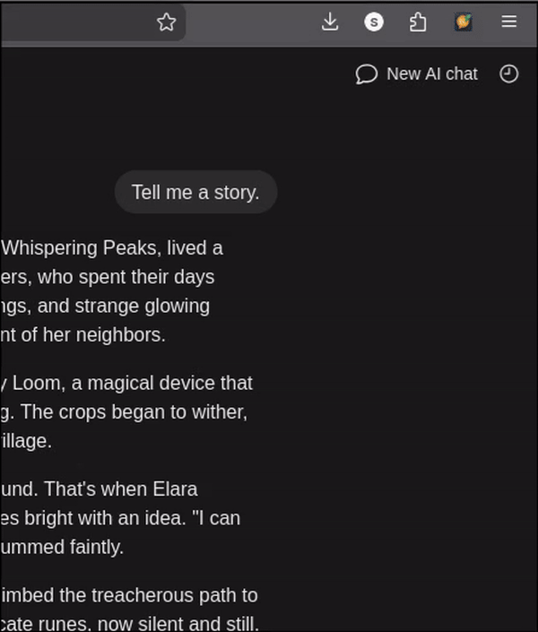

# Notion Forge

[](https://github.com/git-scarrow/notion-forge/actions/workflows/lint.yml)

Notion Forge is a reverse-engineered operations toolkit for [Notion AI](https://www.notion.so/product/ai), custom Notion agents, and Notion-backed agent workflows. It combines a browser extension, Tampermonkey userscript, Python CLI, MCP server, dashboard, and dispatch utilities for working with Notion beyond the public API surface.

The original chat exporter is still here: it captures live and historical Notion AI conversations as Markdown or JSON, including tool calls, model info, thread titles, and conversation structure. The project now also manages custom agent instructions, publishes agent versions, queries workspace data, mirrors Claude.ai Project assets, audits Lab workflow state, and drives programmatic dispatch loops.




---

## Features

- **AI conversation capture** — live and historical Notion AI thread capture with Markdown/JSON export
- **High-fidelity transcripts** — tool calls, model info, thread titles, mentions, and conversation metadata
- **Custom agent management** — read, update, create, publish, and grant access for Notion AI agents
- **MCP server** — expose Notion agent, database, dispatch, and Claude Project operations to external agent clients
- **Compressed Lab querying** — delegate broad Notion questions to `lab_query`, a MiniMax M2.5 query agent that returns canonical answers without flooding context with raw database JSON
- **Operational dashboard** — inspect Notion databases and aggregate workflow state from a local web UI
- **Lab dispatch plane** — validate gates, build dispatch packets, ingest normal and fallback returns, and reconcile workflow state
- **Claude.ai Project sync** — list, read, upload, delete, and sync Claude Project instructions and documents
- **Multiple delivery surfaces** — Firefox extension, Tampermonkey userscript, Python CLI, MCP tools, and local dashboard

---

## Components

| Component | Purpose |
|---|---|
| `manifest.json`, `background/`, `popup/`, `agent-manager/` | Firefox extension for Notion AI capture/export and browser-side agent management |
| `tampermonkey/notion-ai-scraper.user.js` | Userscript version of the conversation capture/export path |
| `cli/mcp_server.py` | MCP server for Notion agents, databases, dispatch workflows, and Claude Project operations |
| `cli/update_agent.py`, `cli/create_agent.py` | CLI tools for custom Notion agent instruction and publish workflows |
| `cli/dashboard_server.py`, `dashboard/` | Local dashboard for Notion database inspection and aggregation |
| `cli/dispatch.py`, `cli/dispatch_tools.py`, `cli/contracts/` | Dispatch contract builder, validation gates, schemas, MCP tools, and return handling |
| `cli/claude_cli.py`, `cli/claude_client.py` | Claude.ai Project instruction/document sync |

---

## Browser Capture Install

### Option A: Firefox Extension (recommended)

1. Download the latest `.xpi` from [Releases](https://github.com/git-scarrow/notion-forge/releases)
2. In Firefox: `about:addons` → gear icon ⚙️ → **Install Add-on From File...**
3. Select the `.xpi` — it installs permanently and survives restarts

### Option B: Tampermonkey Userscript

1. Install [Tampermonkey](https://www.tampermonkey.net/) for your browser
2. Install from [Greasy Fork](https://greasyfork.org/en/scripts/567924-notion-ai-chat-scraper) — or open the [userscript](tampermonkey/notion-ai-scraper.user.js) and click **Raw**
3. Tampermonkey will prompt you to install it

> If using both, disable one — they'll double-capture if both are active.

---

## Usage

### Conversation Capture

**Firefox extension:**
1. Navigate to any Notion AI chat page (`notion.so/...?wfv=chat` or open the AI sidebar)
2. Click the extension icon in the toolbar
3. Conversations appear as you open chats — click **Export All → MD** or **JSON**

**Tampermonkey:**
1. Navigate to a Notion AI chat page
2. Click the Tampermonkey icon → use the menu commands:
   - `Export All → Markdown`
   - `Export All → JSON`
   - `Show capture stats`
   - `Clear captured conversations`

**To capture historical chats:** open each chat thread in Notion — the extension captures messages as Notion fetches them. Clear Notion's IndexedDB cache (`F12 → Application → Storage → Clear site data`) to force a fresh fetch of all cached messages.

### Agent and Workflow Operations

```bash
# Dump, update, or publish custom Notion agent instructions
cli/.venv/bin/python cli/update_agent.py librarian --dump
cli/.venv/bin/python cli/update_agent.py librarian path/to/instructions.md

# Run the MCP server
cli/.venv/bin/python cli/mcp_server.py

# Start the local dashboard
cli/.venv/bin/python cli/dashboard_server.py --port 8099

# Use the Claude Project sync CLI
cli/.venv/bin/python cli/claude_cli.py --help
```

For broad Lab questions, prefer the `lab_query` agent through the `notion-agents`
MCP server instead of pulling large raw database payloads into context. It runs on
MiniMax M2.5 (`fireworks-minimax-m2.5`) and should preserve canonical answer
sets while compressing output. Exact count answers must state their scope; the
current smoke check is:

```text
Work Items: 581 total; Dispatch Ready: 22.
```

The dispatch return path has two MCP surfaces: `handle_final_return` for normal
execution-plane returns with a dispatch packet/run ID, and `direct_closeout_return`
for fallback closeout when no GitHub issue or trusted dispatch packet exists. Both
stamp `Return Received At` / `Return Consumed At` and append result blocks so the
Intake Clerk can continue the pipeline.

See [cli/README.md](cli/README.md), [CLAUDE.md](CLAUDE.md), and [docs/LAB_LOOP_V1_PROTOCOL.md](docs/LAB_LOOP_V1_PROTOCOL.md) for the operational tooling.

---

## Output format

### JSON
```json
[
  {
    "id": "thread-abc123",
    "title": "Pre-Flight Controller validation task",
    "model": "avocado-froyo-medium",
    "turns": [
      { "role": "user", "content": "Create a pre-flight checklist page", "timestamp": 1234567890 },
      { "role": "assistant", "content": "I'll create that page now...", "thinking": "The user wants...", "timestamp": 1234567891 }
    ],
    "toolCalls": [
      { "tool": "create_page", "input": { "title": "Pre-Flight Checklist" } }
    ],
    "createdAt": 1234567890
  }
]
```

### Markdown
```markdown
# Notion AI Chat — Pre-Flight Controller validation task (avocado-froyo-medium)
_ID: thread-abc123_

**You**

Create a pre-flight checklist page

---

**Notion AI**

I'll create that page now...
```

---

## How it works

Notion AI uses two private API endpoints:

| Endpoint | Purpose |
|----------|---------|
| `POST /api/v3/runInferenceTranscript` | Live streaming responses (NDJSON) |
| `POST /api/v3/syncRecordValuesSpaceInitial` | Historical thread + message records |

The interceptor patches `window.fetch` in the page's main JavaScript context (before Notion's [SES lockdown](https://github.com/endojs/endo/tree/master/packages/ses) runs) to observe both endpoints.

- **Extension:** uses `"world": "MAIN"` in the manifest; a bridge script relays data to the background service worker via `postMessage`
- **Tampermonkey:** uses `@grant unsafeWindow` to patch the real page fetch directly

See [docs/ARCHITECTURE.md](docs/ARCHITECTURE.md) for protocol details.

---

## Building / signing

```bash
# Lint
npx web-ext lint

# Sign for self-distribution (requires AMO API key)
npx web-ext sign --api-key=YOUR_KEY --api-secret=YOUR_SECRET --channel=unlisted
```

---

## Known limitations

- `‣` page mentions in **assistant** text can't be resolved — Notion streams them as bare Unicode characters with no metadata. User message mentions are resolved to `[page:id]` / `[user:id]` / `[agent:id]`.
- Messages already in Notion's local OPFS/SQLite cache won't transit the network — clear site data to force a re-fetch.

---

## Credits

See [CREDITS.md](CREDITS.md).

## License

MIT
